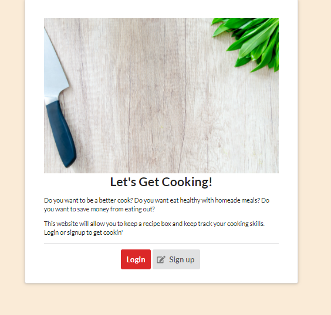
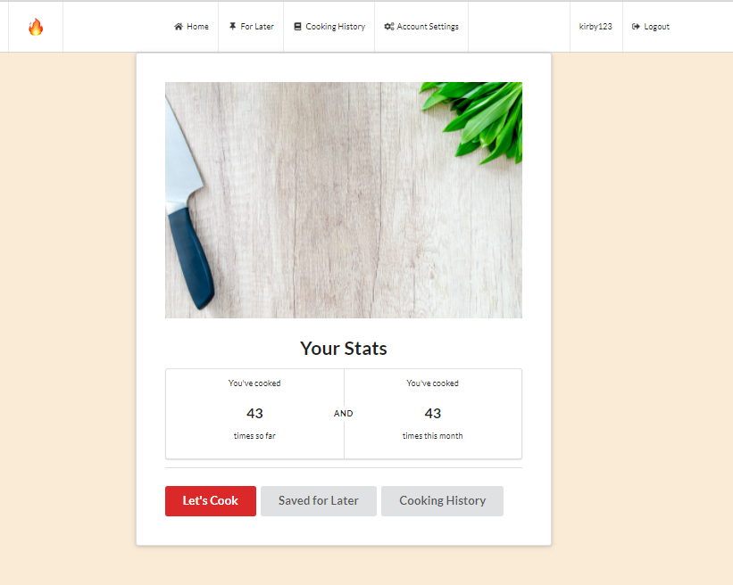
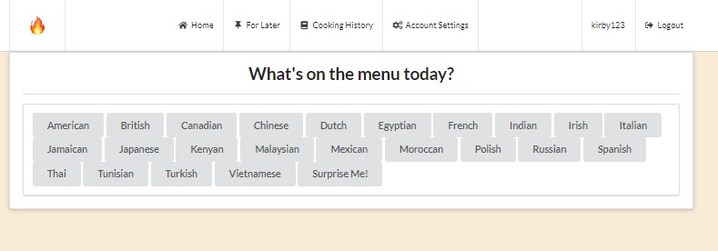
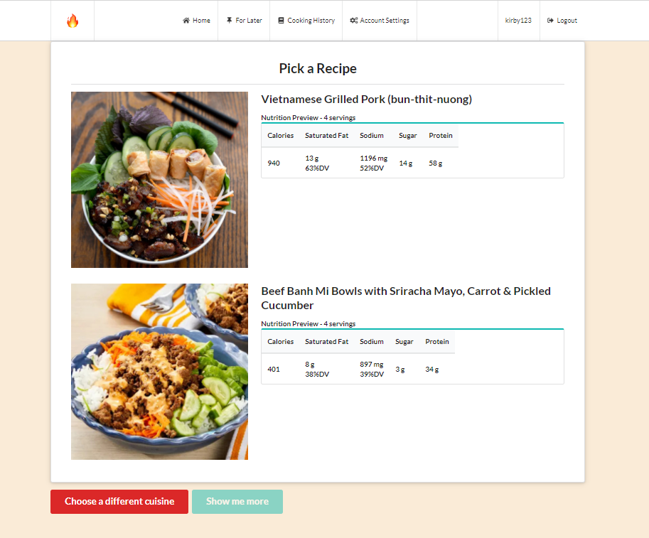
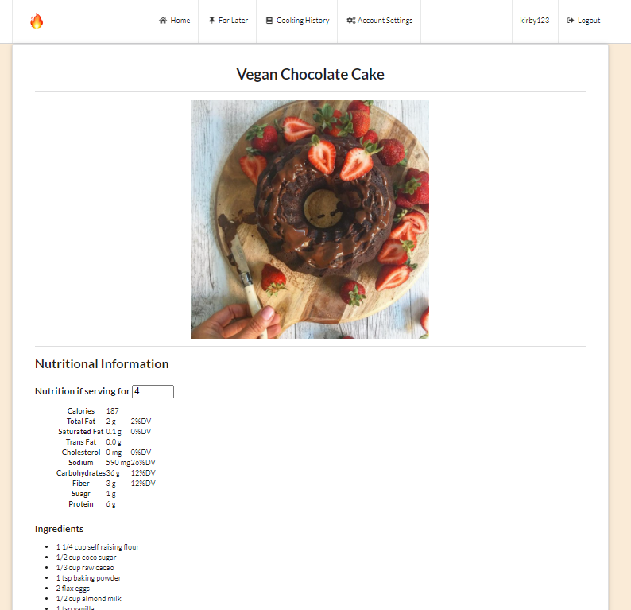
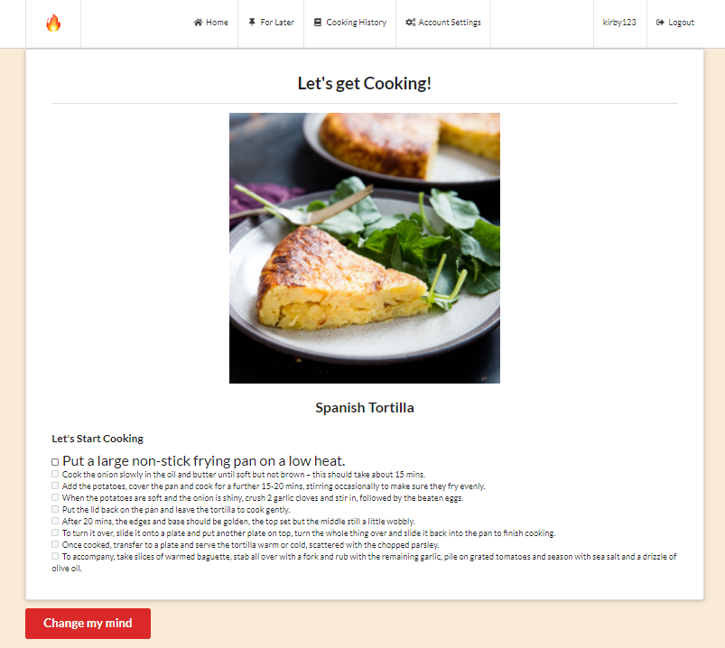
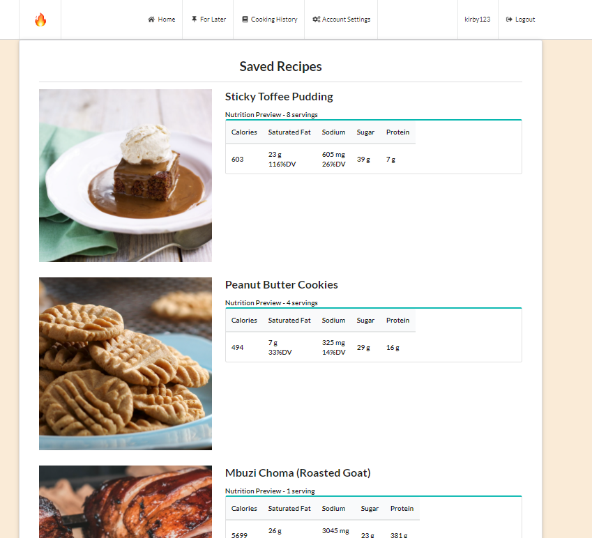
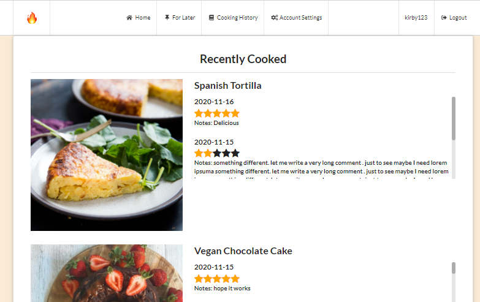

# project-1# From Scratch - Your Cooking Helper

## Description
From Scratch is a website is a recipe box that allows the user to search for recipes and their nutritional facts. The user can keep track of their previous cooking adventure. This website uses two server-side APIs:
* [TheMealDB](https://www.themealdb.com/api.php) : Recipe Database 
* [Nutritionix](https://www.nutritionix.com/business/api) : Nutrition Database

The website uses [Semantic UI](https://semantic-ui.com/) framework for a responsive layout. Javascript was used to request data from the APIs and dynamically change the layout of the website. Localstorage was used to store the user cooking history.

## User Story
```
As an aspiring cook 
I WANT to find diverse recipes
So THAT I can improve my culinary skills, be more health conscious and minimize take-out.
```

## Acceptance Criteria
```
GIVEN I am using the personal recipe box to find recipes
WHEN I open the recipe box
THEN I am presented with the login/sign up page
WHEN I login 
THEN I am presented with the home page
WHEN I sign up with an unique username
THEN my user account is activated and I am presented with the home page
WHEN I login or sign up for the first time
THEN I am given a choice if I want to stay logged in
WHEN I am at the homepage
THEN I am given the option to search for new recipes, recipes that I have saved or recipes that I have cooked
WHEN I select to choose a new recipe,
THEN I am presented with a menu with different national cuisines and a Surprise Me option
WHEN I select a cuisine
THEN I am presented with up to five random recipes with their nutritional facts preview of that cuisine 
WHEN I select the Suprise Me option
THEN I am presented with one random recipe with its nutritional fact preview
WHEN I select a recipe
THEN I am presented with the nutritional facts, ingredients and instructions
WHEN I change the number of serving
THEN I am given appropriate nutitional information for that number of servings
WHEN I want to save the recipe for later
THEN I can save and go back to the previous list of recipes
WHEN I am ready to cook the recipe
THEN I am presented in a step-by-step manner on what ingredients I need and the steps to make the recipe
WHEN I complete all the steps
THEN I prompted with a review to rate my meal and/or leave feedback for future reference
WEHN I finish review my cooking
THEN the recipe is saved into a Cooking History list
WHEN I view my Cooking History
THEN I see the rating and feedback for each recipe that I have made and can cook them again
WHEN I view my Saved for Later list
THEN I will see all the recipes that I have saved which I can view and cook
WHEN I logout of the website
THEN I am back to the login/sign up page
WHEN I go to Account Settings
THEN I can edit my username, my password or delete account
```

Here are the screenshots of Recipe Box App.
Login page
 

Home page
 

List of Cuisines
 

List of Recipes
 

Recipe Page
 

Cook it Page
 

Saved Recipes
 

Cooking history
 


Link to the Github repository: https://github.com/akwanmtl/project-1  

Link to the website: https://akwanmtl.github.io/project-1

## Credits

Collaborators:
* [Keith Crooc](https://github.com/keithyyy)
* [Javier Rincon-Gallardo](https://github.com/jrincongr)

Websites:
* [TheMealDB](https://www.themealdb.com/api.php) 
* [Nutritionix](https://www.nutritionix.com/business/api)
* [License badge link](https://gist.github.com/lukas-h/2a5d00690736b4c3a7ba)

## License

[](https://opensource.org/licenses/MIT)

Copyright (c) [2020] [Annie Kwan]
